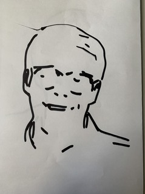

# sketchbot
| Demo             | Example Result              |
| ---------------------- | ---------------------- |
|  |  |
 

Course project for ROB514 at Oregon State University. We use a UR5e to click a photo of someone at a fixed "say_cheese" position and sketch the same using a sharpie on a piece of a paper held at the draw_board frame. 

This project is built with ROS2 Humble, OpenCV and MoveIt2. This repo includes code from [linedraw](https://github.com/LingDong-/linedraw/) licensed under the MIT license in cv_pipeline. We also use the [Universal_Robots_ROS2_Gazebo_Simulation](https://github.com/UniversalRobots/Universal_Robots_ROS2_Gazebo_Simulation) licensed under the BSD license for simulations. Meshes for the sharpie and 3D printed pen holder mount can be found in the drawbot package.

## Run demo with hardware
### Bringup UR5e and MoveIt controllers
```bash
ros2 launch drawbot drawbot_ur_bringup.launch.py 
```

### Starting Drawbot Server to advertise services
```bash
ros2 launch drawbot drawbot.launch.py
```

### Invoke service to start draw pipeline
```bash
ros2 service call /drawbot sketchbot_interfaces/srv/Drawbot
```

## Useful launch invocations
### Starting Moveit with custom config
```bash
ros2 launch drawbot_moveit_config ur_moveit.launch.py ur_type:=ur5e
```

### Starting Gazebo w Controllers + Moveit
```bash
# has a 1 minute wait time in ur_sim_control.launch.py to ensure gazebo finishes spawning
ros2 launch ur_simulation_gazebo ur_sim_moveit.launch.py ur_type:=ur5e use_sim_time:=True
```

